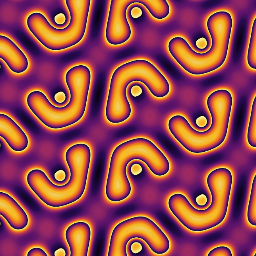

# Gray-Scott Reaction-Diffusion Simulation

Interactive WebGL simulation of the [Gray-Scott reaction-diffusion system](https://en.wikipedia.org/wiki/Reaction%E2%80%93diffusion_system) with wallpaper symmetry groups.

**[▶ Live Demo](https://yaroslavvb.github.io/gray-scott/)**



## Running Locally

```bash
git clone https://github.com/yaroslavvb/gray-scott.git
cd gray-scott
python3 -m http.server 8080
```

Then open http://localhost:8080 in your browser.

## Controls

- **Right panel** — Expand sections to adjust simulation parameters, visualization, symmetry, etc.
- **Toolbox** (top-left) — Play/pause, restart, save image, pan/zoom, draw
- **Mouse drag** — Pan the pattern
- **Scroll wheel** — Zoom in/out
- **Display → frame time** — Shows render time per frame

## About

The Gray-Scott model simulates two chemical species (U and V) reacting and diffusing on a 2D surface:

```
∂U/∂t = Dᵤ∇²U - UV² + F(1-U)
∂V/∂t = Dᵥ∇²V + UV² - (F+k)V
```

Parameters **F** (feed rate) and **k** (kill rate) control the pattern type — from spots and stripes to spirals and chaos.

The simulation runs entirely on the GPU using WebGL2 fragment shaders for real-time performance.

## Credits

Built on the [SymmHub](https://github.com/SymmHub/SymmHub) engine by Vladimir Bulatov, Chaim Goodman-Strauss, and Scott Vorthmann.

## License

See [LICENSE](LICENSE) for details.
